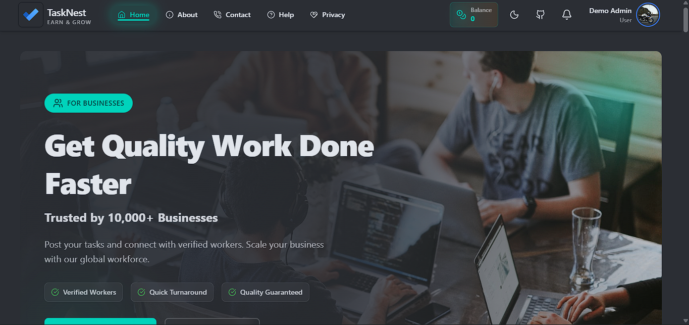
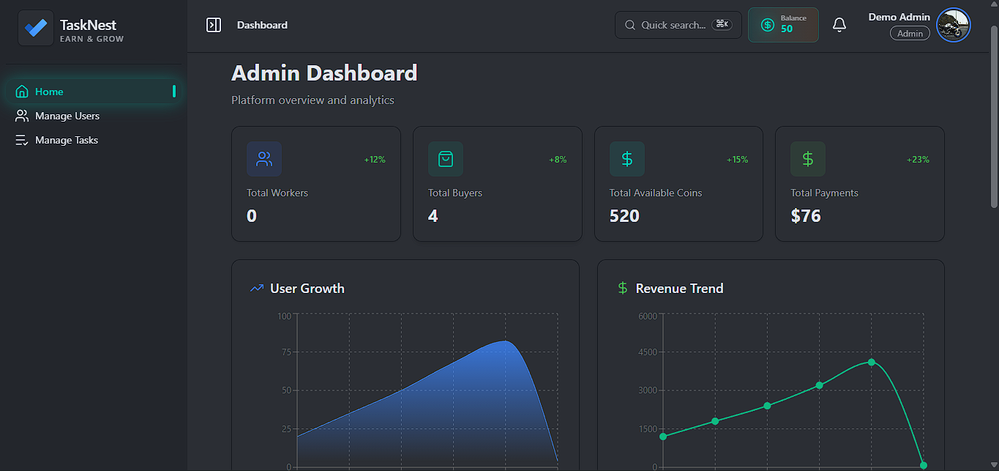

# TaskNest 🎯

[](https://github.com/hossain-shifat/TaskNest)

> A comprehensive micro-tasking and earning platform built with the MERN stack, enabling users to complete tasks, earn rewards, and manage their workflow efficiently.

[](https://tasknest-8cfc3.web.app)
[](https://github.com/hossain-shifat/TaskNest-Client)
[](https://github.com/hossain-shifat/TaskNest-Server)

---

## 🔐 Admin Credentials

**Admin Email:** `demo@admin.com`  
**Admin Password:** `As1234`

---

## 🌟 Key Features

### 🎨 User Experience
- **Responsive Design** - Seamlessly adapts to mobile, tablet, and desktop devices with fully responsive dashboard
- **Interactive Animations** - Engaging GSAP and Motion animations throughout the platform for enhanced user experience
- **Real-time Notifications** - Dynamic notification system keeping users updated on task status, approvals, and withdrawals
- **Role-based Dashboards** - Customized interfaces for Workers, Buyers, and Admins with role-specific functionalities

### 👤 Multi-Role System
- **Worker Role** - Complete tasks, track submissions, earn coins, and withdraw earnings
- **Buyer Role** - Create tasks, review submissions, manage payments, and purchase coins
- **Admin Role** - Oversee platform operations, manage users, approve withdrawals, and maintain system integrity

### 💰 Task & Payment Management
- **Flexible Task Creation** - Buyers can create detailed tasks with custom requirements, deadlines, and rewards
- **Secure Payment Integration** - Stripe-powered payment system for coin purchases
- **Smart Withdrawal System** - Workers can withdraw earnings with multiple payment options (minimum 200 coins)
- **Automated Coin Management** - Intelligent coin distribution and refund system based on task lifecycle

### 🔒 Security & Authentication
- **Firebase Authentication** - Secure login/registration with email/password and Google Sign-In
- **JWT Token Management** - Protected routes with secure token-based authentication
- **Role-based Authorization** - Middleware-protected routes ensuring users access only authorized content
- **Environment Variables** - Sensitive credentials secured using environment configuration

### 📊 Advanced Dashboard Features
- **Comprehensive Statistics** - Real-time data visualization showing earnings, tasks, and platform metrics
- **Task Review System** - Streamlined submission approval/rejection workflow for buyers
- **Pagination Support** - Optimized data loading with pagination on submission pages
- **Payment History** - Complete transaction records for financial transparency

### 🎯 Platform Intelligence
- **Top Workers Showcase** - Homepage highlights the 6 highest-earning workers to inspire community
- **Smart Task Filtering** - Workers see only available tasks with required_workers > 0
- **Business Logic** - Built-in profit margin with 2:1 withdrawal ratio (20 coins = $1)
- **Data Persistence** - User sessions maintained across page reloads with no login redirects

---

## 🛠️ Technologies Used

### Frontend
- **React 19** - Latest React version with modern hooks and features
- **React Router 7** - Advanced client-side routing with nested routes
- **TailwindCSS 4** - Utility-first CSS framework for rapid UI development
- **DaisyUI** - Beautiful component library built on Tailwind
- **GSAP** - Professional-grade animation library
- **Motion** - Declarative animations for React
- **Recharts** - Composable charting library for data visualization
- **Axios** - Promise-based HTTP client
- **React Hook Form** - Performant form validation
- **TanStack Query** - Powerful data synchronization
- **SweetAlert2** - Beautiful, responsive popup boxes
- **Lucide React** - Clean and consistent icon set

### Backend
- **Node.js** - JavaScript runtime environment
- **Express.js** - Fast, minimalist web framework
- **MongoDB** - NoSQL database for flexible data storage
- **Firebase Admin SDK** - Server-side authentication and authorization
- **Stripe API** - Secure payment processing

### Authentication & Security
- **Firebase Authentication** - Email/password and Google OAuth
- **JWT (JSON Web Tokens)** - Secure API authorization
- **Environment Variables** - Protected configuration management

---

## 📦 Installation & Setup

### Prerequisites
- Node.js (v18 or higher)
- MongoDB account
- Firebase project
- Stripe account (for payment integration)

### Client-Side Setup

```bash
# Clone the repository
git clone https://github.com/hossain-shifat/TaskNest-Client.git

# Navigate to project directory
cd TaskNest-Client

# Install dependencies
npm install

# Create .env.local file in root directory
touch .env.local
```

Add the following environment variables to `.env.local`:

```env
VITE_APIKEY=your_firebase_api_key
VITE_AUTHDOMAIN=your_firebase_auth_domain
VITE_PROJECTID=your_firebase_project_id
VITE_STORAGEBUCKET=your_firebase_storage_bucket
VITE_MESSAGINGSENDERID=your_firebase_messaging_sender_id
VITE_APPID=your_firebase_app_id
VITE_API_URL=http://localhost:5000
```

```bash
# Start development server
npm run dev
```

### Server-Side Setup

```bash
# Clone the server repository
git clone https://github.com/hossain-shifat/TaskNest-Server.git

# Navigate to server directory
cd TaskNest-Server

# Install dependencies
npm install

# Create .env file in root directory
touch .env
```

Add the following environment variables to `.env`:

```env
MONGODB_URI=your_mongodb_connection_string
PORT=5000
JWT_SECRET=your_jwt_secret_key
STRIPE_SECRET_KEY=your_stripe_secret_key
FIREBASE_ADMIN_SDK=your_firebase_admin_sdk_json
```

```bash
# Start server
npm start
```

---

## 🚀 Usage Guide

### For Workers
1. Register as a Worker (receive 10 coins bonus)
2. Browse available tasks in the Task List
3. Submit task completions with required details
4. Track submissions and earnings in dashboard
5. Withdraw earnings when reaching 200+ coins

### For Buyers
1. Register as a Buyer (receive 50 coins bonus)
2. Purchase coins via Stripe payment
3. Create tasks with detailed requirements
4. Review and approve/reject worker submissions
5. Monitor task progress and payment history

### For Admins
1. Access admin dashboard with credentials
2. Manage user roles and permissions
3. Approve withdrawal requests
4. Monitor platform statistics
5. Delete inappropriate tasks or users

---

## 📱 Screenshots

[](https://github.com/hossain-shifat/TaskNest)
*Engaging homepage with animated hero section and top workers showcase*

[](https://github.com/hossain-shifat/TaskNest)
*Intuitive role-based dashboard with real-time statistics*

---

## 🤝 Contributing

Contributions are welcome! Please feel free to submit a Pull Request.

1. Fork the repository
2. Create your feature branch (`git checkout -b feature/AmazingFeature`)
3. Commit your changes (`git commit -m 'Add some AmazingFeature'`)
4. Push to the branch (`git push origin feature/AmazingFeature`)
5. Open a Pull Request

---

## 📄 License

This project is created as part of a MERN Stack Developer assessment.

---

## 👨‍💻 Developer

**Hossain Shifat**

- GitHub: [@hossain-shifat](https://github.com/hossain-shifat)
- Email: [Hossain-Shifat](hossainshifat222@gmail.com)

---

## 🙏 Acknowledgments

- Design inspiration from Picoworkers and Clickworker
- Icons by Lucide React
- UI components by DaisyUI
- Animation libraries: GSAP and Motion

---

<div align="center">

**[⬆ Back to Top](#tasknest-)**

Made with ❤️ by Hossain Shifat

</div>